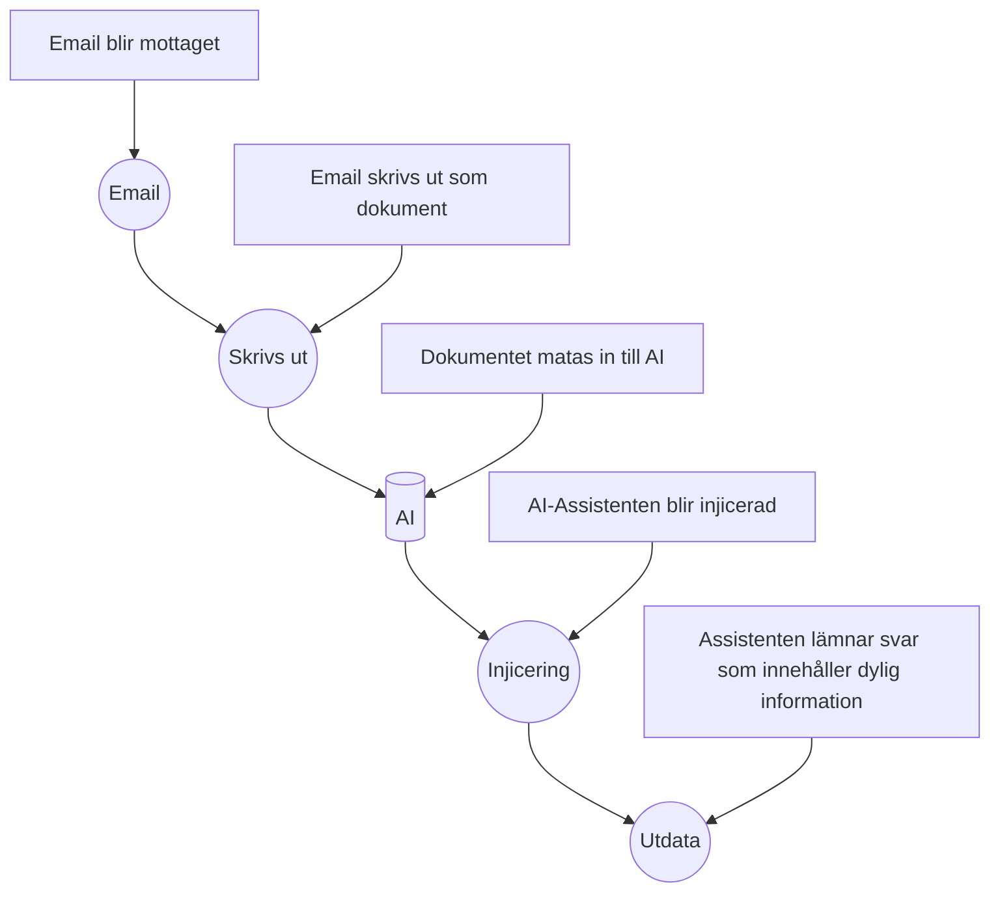

Detta diagram är en kopia i del 04. Exempel 01

```mermaid
flowchart TB
    email(("Email"))
    writeout(("Skrivs ut"))
    ai[("AI")]
    inject(("Injicering"))
    quest(("Utdata"))
    
    
    descr1["Email blir mottaget"]
    descr2["Email skrivs ut som dokument"]
    descr3["Dokumentet matas in till AI"]
    descr4["AI-Assistenten blir injicerad"]
    descr5["Assistenten lämnar svar som innehåller dylig information"]
    
    email --> writeout
    writeout --> ai
    ai --> inject
    inject --> quest
    
    descr1 --> email
    descr2 --> writeout
    descr3 --> ai
    descr4 --> inject
    descr5 --> quest
```